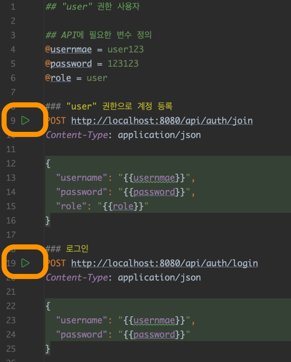

# spring-session-authn-authz-sample

Spring Boot를 이용한 세션 기반 인증/인가 샘플.

**주의할 점**
- 대부분 개발자는 예제로 공부하는데, 이런 예제는 주제에 집중할 수 있도록 단순화되어 있습니다.
- 이 때문에 개발자가 잘못된 접근 방식에 익숙해질 수 있으며, 예제로 배운 모든 내용이 좋은 습관이라고 착각할 수 있습니다.
- 예제를 실제 상황에 적용할 때는 그대로 적용하지 말고, 한 번 더 생각해보는 것이 좋습니다.

## H2 콘솔 사용방법

[H2 콘솔 사용방법](/docs/h2/HOW-TO-USE-H2-CONSOLE.md)

## API 테스트 방법

1. 스프링 서버를 기동합니다.
2. `.http` 파일을 엽니다.
3. 아래 스크린샷에 표시한 버튼을 누르면서 `request`를 보내 테스트할 수 있습니다.
  

